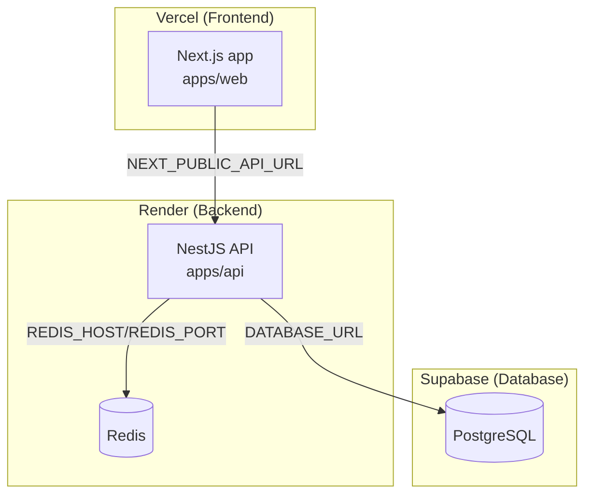
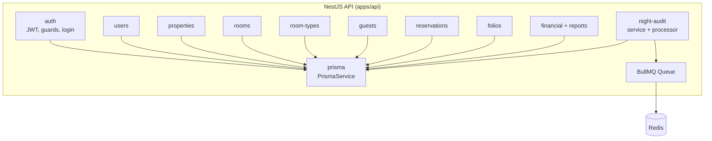
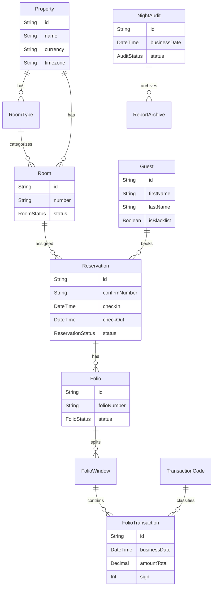
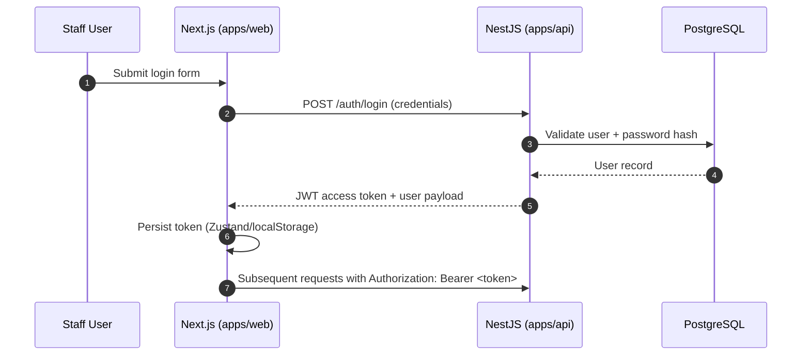
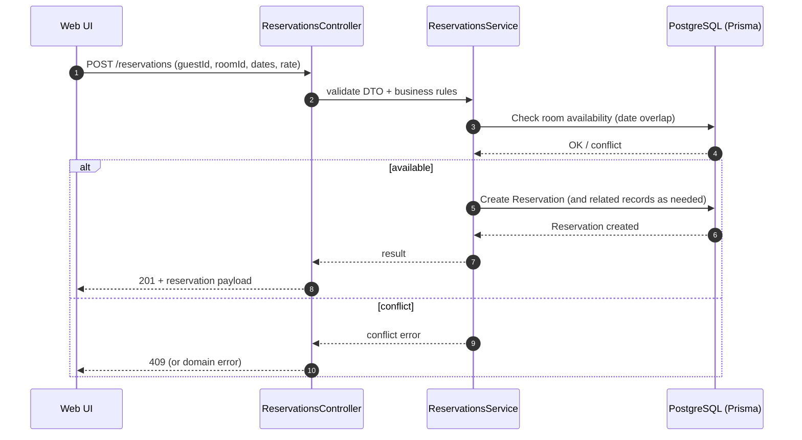
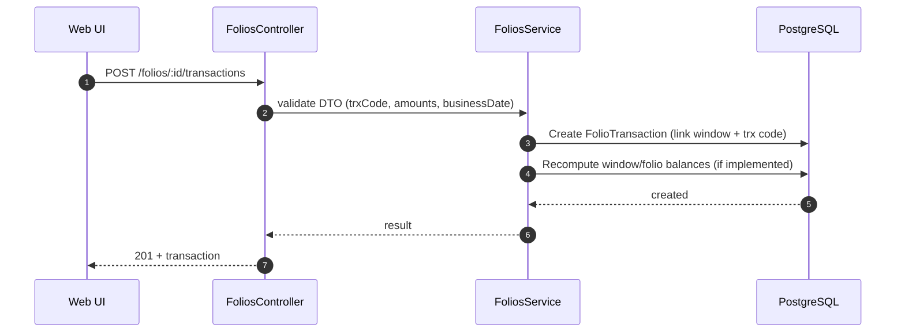
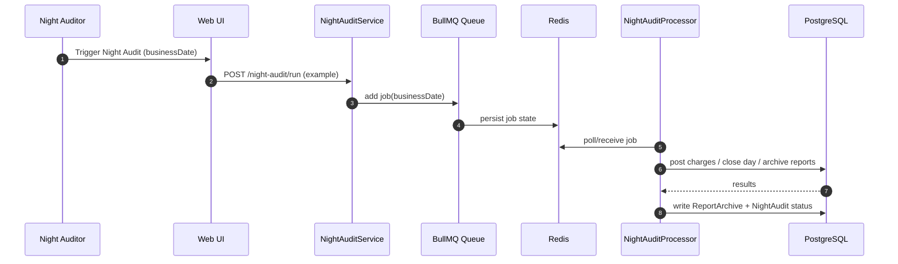
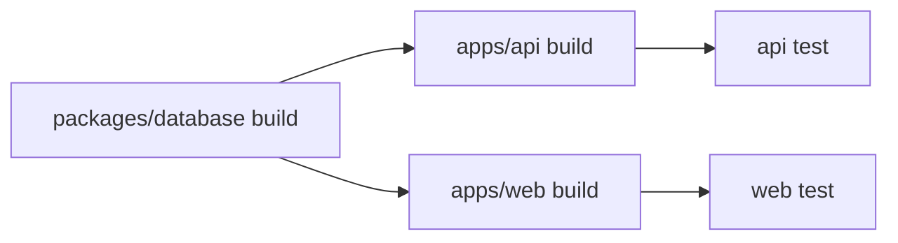

# PURA PMS — Architecture

This document describes the **actual, current architecture** of the PURA PMS monorepo based on the code in this repository.

## Goals & non-goals

- **Goals**
  - Provide a shared mental model across **Web (Next.js)**, **API (NestJS)**, and **Database (Prisma/PostgreSQL)**.
  - Document the **runtime topology**, **module boundaries**, **data model**, and **key flows** (Auth, Reservation, Billing/Folio, Night Audit).
  - Make it easy for new contributors to find the right place to change code.
- **Non-goals**
  - This is not a full PRD. See `docs/planning/prd.md` and `docs/planning/roadmap.md`.
  - This is not a complete database reference. The source of truth is `packages/database/prisma/schema.prisma`.

## Tech stack (current)

- **Monorepo**: pnpm workspaces + Turborepo (`pnpm-workspace.yaml`, `turbo.json`)
- **Web**: Next.js App Router (Next 16), React 19, Tailwind 4, TanStack Query, Zustand, Radix UI (`apps/web`)
- **API**: NestJS 11, Prisma Client (via `@pura/database`), JWT Auth, BullMQ (Redis-backed jobs) (`apps/api`)
- **Database**: PostgreSQL + Prisma schema + seed/test utilities (`packages/database`)
- **Quality**: ESLint, Prettier, Vitest (web/api/database), Playwright (web e2e), SonarQube, Sentry

## Repository layout

```text
pura/
  apps/
    web/                 # Next.js frontend
    api/                 # NestJS backend
  packages/
    database/            # Prisma schema, client build, seed, DB tests
  docs/                  # PRD, roadmap, standards, sprint reports
```

Key files:

- **Monorepo**
  - `pnpm-workspace.yaml`
  - `turbo.json`
  - `package.json` (root scripts for dev/build/test/sonar)
- **Web entry**
  - `apps/web/src/app/layout.tsx` (AppLayout + QueryProvider + ErrorBoundary)
  - `apps/web/src/lib/api/client.ts` (APIClient + optional mock routing)
- **API entry**
  - `apps/api/src/main.ts` (CORS + ValidationPipe + listen)
  - `apps/api/src/app.module.ts` (module wiring + BullMQ/Redis)
- **Database**
  - `packages/database/prisma/schema.prisma`
- **Deployment**
  - `DEPLOYMENT.md` (Vercel + Render + Supabase guidance)

## System context (high level)

```mermaid
flowchart LR
  U[Hotel Staff / Back Office Users] -->|HTTPS| WEB[Web App\nNext.js]
  WEB -->|HTTPS REST + JWT| API[API Service\nNestJS]
  API -->|SQL (Prisma)| DB[(PostgreSQL)]
  API -->|Jobs (BullMQ)| REDIS[(Redis)]
  WEB -->|Errors/Traces| SENTRY[(Sentry\noptional)]
  API -->|Errors/Traces| SENTRY
```

## Containers / deployment topology

Current recommended deployment (from `DEPLOYMENT.md`):

- **Web** deployed on **Vercel**
- **API** deployed on **Render**
- **PostgreSQL** hosted on **Supabase**
- **Redis** required for BullMQ (Night Audit jobs). In dev it defaults to `localhost:6379` (see `apps/api/src/app.module.ts`).



## Web architecture (`apps/web`)

### Rendering model

- Uses **Next.js App Router** under `apps/web/src/app/**`.
- Global wiring lives in `apps/web/src/app/layout.tsx`:
  - Layout shell: `AppLayout`
  - Data fetching cache: `QueryProvider` (TanStack Query)
  - UI resilience: `ErrorBoundary`
  - Toast notifications: `Toaster`

### UI composition

- Shared UI primitives under `apps/web/src/components/ui/**` (Radix-based components).
- Domain and shared components under `apps/web/src/components/**`.
- Domain pages under `apps/web/src/app/**`.

### Client-side data access

Primary entrypoint: `apps/web/src/lib/api/client.ts`

- `APIClient` wraps `fetch()` and:
  - Sets JSON headers
  - Adds `Authorization: Bearer <token>` when present (reads from `localStorage`)
  - Throws `APIError` on non-2xx responses
  - Supports a **mock API intercept** via `NEXT_PUBLIC_USE_MOCK_API === 'true'` using `apps/web/src/lib/api/mock/router`

Barrel exports: `apps/web/src/lib/api/index.ts` re-exports domain clients (auth, properties, rooms, room-types, guests, reservations, folios).

### Frontend auth state

- Persisted auth state via Zustand in `apps/web/src/lib/stores/use-auth-store.ts`
- The API layer also stores a token in `localStorage` (`getAuthToken()` in `client.ts`).

> Note: This implies **two token storages** (Zustand persist + `localStorage` access in API client). Keep them consistent when changing auth flows.

## API architecture (`apps/api`)

### Bootstrapping and cross-cutting concerns

Entrypoint: `apps/api/src/main.ts`

- **CORS** enabled with allowlist from `CORS_ORIGIN` (comma-separated), defaults to localhost web ports
- **Global ValidationPipe**
  - `whitelist: true` (strip unknown fields)
  - `transform: true` (DTO transformation)

Module wiring: `apps/api/src/app.module.ts`

- Imports functional modules:
  - `AuthModule`, `UsersModule`
  - `PropertiesModule`, `RoomTypesModule`, `RoomsModule`, `GuestsModule`, `ReservationsModule`
  - `FoliosModule`, `FinancialModule`
  - `NightAuditModule`
- Infra:
  - `PrismaModule`
  - `LoggerModule`
  - `BullModule.forRoot(...)` using `REDIS_HOST` / `REDIS_PORT`

### API module boundaries (current)



### Background jobs (BullMQ)

- BullMQ is configured globally in `apps/api/src/app.module.ts`.
- The Night Audit implementation is in `apps/api/src/night-audit/*`:
  - `night-audit.service.ts`
  - `night-audit.processor.ts`

At runtime:

- API enqueues jobs (BullMQ)
- Redis stores queue state
- Processor consumes jobs and performs business logic (posting, report archive, etc.)

## Database architecture (`packages/database`)

### Source of truth

- Schema: `packages/database/prisma/schema.prisma`
- Generated client: `@prisma/client` is produced as part of `@pura/database` build (`packages/database/package.json`)
- `apps/api` depends on `@pura/database` (workspace dependency).

### Domain model (subset)

The full ERD is larger; this diagram highlights core PMS flows: Property → RoomTypes/Rooms, Guest/Reservation, Folio/FolioWindow/FolioTransaction, and Night Audit.



### Financial data integrity (key constraints)

The schema encodes several important financial/audit constraints (examples):

- `Reservation.confirmNumber` is `@unique`
- `Folio.folioNumber` is `@unique`
- `FolioWindow` is unique per `(folioId, windowNumber)`
- `NightAudit` is unique per `businessDate`
- Many financial entities are indexed on `businessDate` and linkage keys for reporting performance

## Key end-to-end flows

### 1) Authentication (Web → API)



Relevant code:

- Web API client/token: `apps/web/src/lib/api/client.ts`
- Web persisted auth state: `apps/web/src/lib/stores/use-auth-store.ts`
- API auth module: `apps/api/src/auth/**`

### 2) Create reservation (Core front office)



### 3) Post a folio transaction (Billing)

The schema supports enhanced folio posting with:

- `TransactionCode` (classification + GL mapping)
- `FolioWindow` (split billing)
- `FolioTransaction` (net/service/tax/total + audit links)



### 4) Night audit (Jobs + reporting archive)



> Endpoint naming for Night Audit may evolve; the concrete implementation lives under `apps/api/src/night-audit/*`.

## Configuration & environment variables

### Web (`apps/web`)

- **`NEXT_PUBLIC_API_URL`**: API base URL (defaults to `http://localhost:3001`)
- **`NEXT_PUBLIC_USE_MOCK_API`**: `true` to route requests to mock router
- **`NEXT_PUBLIC_APP_URL`**: used for `metadataBase` in `apps/web/src/app/layout.tsx`

### API (`apps/api`)

- **`DATABASE_URL`**: Postgres connection string (Prisma)
- **`JWT_SECRET`**: JWT signing secret
- **`PORT`**: API port (defaults to 3001)
- **`CORS_ORIGIN`**: comma-separated allowlist for Web origins
- **`REDIS_HOST` / `REDIS_PORT`**: BullMQ Redis connection (defaults to localhost:6379)

See `DEPLOYMENT.md` for deployment-specific values.

## Testing architecture

- **Web**: Vitest + React Testing Library (`apps/web/**/*.test.ts(x)`), Playwright for e2e (`apps/web/e2e/**`)
- **API**: Vitest + `@nestjs/testing` (`apps/api/src/**/*.spec.ts`), plus e2e via vitest config under `apps/api/test/**`
- **Database package**: Vitest tests under `packages/database/prisma/*.test.ts`

## Operational concerns

### Observability

- Web includes Sentry (`@sentry/nextjs` in dependencies). Server Sentry configuration is supported via env vars (see `DEPLOYMENT.md`).

### Security boundaries (current)

- **Authentication**: JWT-based auth in API; Web stores token client-side.
- **Input validation**: API uses NestJS `ValidationPipe` globally (whitelist + transform).
- **CORS**: API uses explicit allowlist via `CORS_ORIGIN`.

## Build & task graph (Turborepo)

Tasks are orchestrated via `turbo.json`:

- `dev` is persistent and uncached
- `build`, `lint`, `type-check`, `test` depend on upstream `^build`
- DB tasks (`db:push`, `db:generate`) are uncached



## Where to go next

- **Business requirements**: `docs/planning/prd.md`, `docs/planning/roadmap.md`
- **Coding & quality standards**: `docs/guidelines/coding_standards.md`
- **Reports**: `docs/planning/reports-master-list.md`, `apps/api/src/financial/reports.service.ts`
- **Financial schema**: `packages/database/prisma/schema.prisma`
