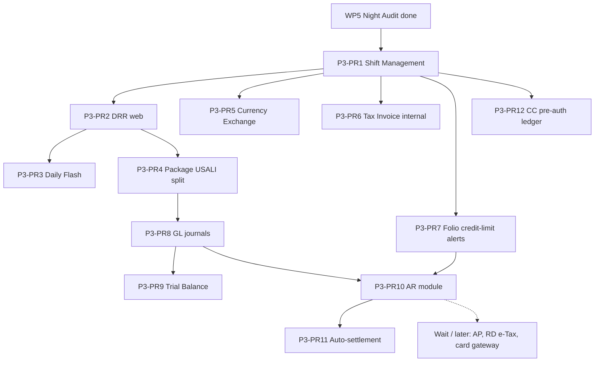

# Phase 3 Closeout Backlog

**Role:** Technical PM  
**Decision:** Finish remaining Phase 3 before more Phase 4.  
**Date:** 2026-08-14  
**Updated:** 2026-08-15  
**Sources:** `docs/planning/prd.md` §4.6, §4.8–4.14, §12; `docs/planning/archive/task.md` Sprint 6–9 leftovers; live schema + API inventory.

## Status (2026-08-15)

**P3-PR1 through P3-PR12 are merged** to `dev` and `main`. Closeout productization (Night Audit in nav, folio/reservation/AR pickers, cash FX on payment `9000`, day-close i18n) is FO polish of the shipped closeout — not a new epic.

**Still wait (do not implement here):** AP, RD e-Tax API, card gateway (Stripe/Omise/2C2P), P&L/bank rec, cashier PDF/email, delete legacy `Transaction`.

Day-use (#33) and Split Stay PR1 (#39) already shipped on `dev` / `main`. **Do not reopen them.** Do not mix Phase 4 epics (Room Move, no-show, walk, complimentary, extended stay, tax exemption, VIP lock).

---

## 1. What Phase 3 already shipped (WP1–WP5)

Archive `task.md` marked Phase 3 “COMPLETE (WP1–WP5)”. That was **foundations only**. P3-PR1–12 later productized the remaining §12 items (AP / RD e-Tax / card gateway stay wait).

| WP        | What shipped                           | Grounding in code                                                                                                                                                                                                                                                                                          |
| --------- | -------------------------------------- | ---------------------------------------------------------------------------------------------------------------------------------------------------------------------------------------------------------------------------------------------------------------------------------------------------------- |
| **WP1**   | Financial schema + seed                | `TransactionCode`, `FolioWindow`, `FolioTransaction`, `ReasonCode`, `RoutingInstruction`, `Deposit`, `FixedCharge`; also **unused** `Shift`, `TaxInvoice`, `ExchangeRate`, `GLAccount`, `JournalEntry`, `JournalLine`, `ARAccount`, `Invoice`, `ReportArchive` in `packages/database/prisma/schema.prisma` |
| **WP2–3** | Transaction codes + folio windows      | `apps/api/src/financial/` CRUD for trx codes; folio windows via `apps/api/src/folios/`                                                                                                                                                                                                                     |
| **WP4**   | Immutable folio posting + reason codes | `FoliosService.postTransaction` / `voidTransaction`; `GET /financial/reason-codes`; **does not set `FolioTransaction.shiftId`**                                                                                                                                                                            |
| **WP5**   | Night Audit (BullMQ, idempotent)       | `POST /night-audit/run`, `GET /night-audit/status/:propertyId/:businessDate`; queue job id `night-audit:${propertyId}:${YYYY-MM-DD}`; posting-level skip; `ReportArchive`; UI `/night-audit`. ADR: `docs/adr/002-night-audit-idempotency-status-report-archive.md`                                         |

**Also already true (do not rebuild):**

- DRR **API** exists: `GET /financial/reports/drr?propertyId=&date=` in `apps/api/src/financial/financial.controller.ts` → `reports.service.ts`.
- Web `/billing` and `/night-audit` exist.
- Web `/reports` is a **Coming Soon** stub (`apps/web/src/app/reports/page.tsx`).
- Prisma stays on **^6.19.2** (do not bump to v7).
- Legacy `Transaction` / `Payment` models remain; **do not delete** them in closeout PRs unless a dedicated cleanup epic is approved later.

**Grep-confirmed gaps:**

- Zero Shift NestJS module/controller/service under `apps/api/src`.
- Zero `shift` usage in `apps/` application code (schema relation only).
- Financial module today: trx-code CRUD, reason-code list, DRR GET only.
- Night Audit does not inspect shifts.

---

## 2. Remaining Phase 3 (PRD §12 + Sprint 8 leftovers)

Unchecked in PRD §12:

1. Shift Management (Enhanced) — §4.6
2. GL / AR / AP (USALI) — §4.10–4.12
3. Tax Invoice (e-Tax Invoice Ready)
4. Currency Exchange
5. Credit Card Pre-authorization
6. Package Revenue Breakdown (USALI split)
7. Credit Limit Alerts & Auto-settlement

Historically Sprint 8 (`task.md`): Daily Revenue Report (DRR), Trial Balance, Daily Flash. DRR API exists; TB needs journals; Flash has no API.

Sprint 10 leftovers in `task.md` (PDPA, TM.30, session management) are **Phase 6 / 7**, not Phase 3 closeout.

---

## 3. Sequencing principles

1. **Cashier / audit day-close first** — Night Audit is live; cashiers cannot open, close, or reconcile a shift.
2. **Use existing schema before inventing ledgers** — Shift, TaxInvoice, ExchangeRate, GL/AR tables already exist.
3. **One epic per PR.** Conventional Commits. Co-located tests. No `any`, no `console.log`.
4. **No giant GL rewrite in the first PRs.** Trial Balance is blocked on journals, not on a reports page.
5. **Slice anything that pulls in a gateway, RD e-Tax, or vendor PO.**
6. **Reports UI can follow Shift** so GM day-view uses real DRR, not a stub — but DRR correctness improves after package split.

---

## 4. Closeout PR sequence

Each row is **one PR**. Implementation base: `dev`. Cloud agent branch pattern: `cursor/<name>-6a5d`.

### P3-PR1 — Shift Management (Enhanced) — **first shippable**

- **Why first:** Unblocks cashier day-close against a live Night Audit. `Shift` + `FolioTransaction.shiftId` already exist. No GL/journal rewrite. Smallest epic that makes WP5 operationally complete.
- **Slice:** Open / close / cash expected vs counted / variance / manager approval / handover / attach `shiftId` on cashier posts / **tiny** Night Audit gate (reject run while any shift is `OPEN` for that property + businessDate).
- **Depends on:** WP4 posting, WP5 Night Audit (both done).
- **Unblocks:** Honest cashier recon; later FX cash-in-drawer; optional cashier report.
- **YAGNI:** e-Tax, payment gateway, AP, GL export, PDF cashier report, deleting `Transaction`.
- **Plan:** `docs/planning/current-sprint.md` (this sprint). **ADR:** `docs/adr/003-shift-management-night-audit-gate.md`.

### P3-PR2 — Daily Revenue Report (web)

- **Why next:** API already exists; `/reports` is a stub. Small, high visibility for GM after day-close.
- **Slice:** Replace Coming Soon with DRR viewer calling `GET /financial/reports/drr`. i18n copy in `messages/en.json` + `th.json`. Co-located tests. No new report engines.
- **Depends on:** DRR API (done). Better after PR1 so the page is part of day-close, not a parallel toy.
- **Can wait:** Excel/PDF export, archive browser, YoY compare (Report Archive exists but is NA-summary only).
- **Files today:** `apps/api/src/financial/reports.service.ts`, `apps/web/src/app/reports/page.tsx`.

### P3-PR3 — Daily Flash

- **Why:** Sprint 8 leftover; operational snapshot (occupancy, arrivals/departures, room revenue) for GM morning meeting.
- **Slice:** Read-only `GET /financial/reports/flash` from reservations + DRR buckets. One web panel on `/reports`. No forecast, no pace.
- **Depends on:** PR2 (share `/reports` shell). Independent of GL.
- **Too large if mixed with:** Manager’s Report, ADR/RevPAR full suite, scheduled email.

### P3-PR4 — Package Revenue Breakdown (USALI split)

- **Why before GL:** DRR groups by `TransactionCode.group`. An inclusive package posted as a single ROOM charge mis-states F&B. Split at **posting time** into existing trx codes (e.g. room `1000` vs F&B).
- **Slice:** Package definition **or** posting-time split rules keyed by rate/package code → multiple `FolioTransaction` rows, same `businessDate`, immutable. Night Audit room post stays single room code unless the covering stay is a package (only if already modeled — do not invent a full rate-package engine if schema has none).
- **Depends on:** WP4 posting; more valuable after PR2 so Flash/DRR can be re-checked.
- **Must slice away:** Rate derivation (Phase 5), yield, SPA package booking (Phase 5/6).
- **Can wait:** UI package builder if a seed mapping table is enough for v1.

### P3-PR5 — Currency Exchange

- **Why after Shift:** Foreign cash hits the **same drawer** (`openingCash` / expected cash). Schema `ExchangeRate` exists; **no API**.
- **Slice:** CRUD rates (`baseCurrency`/`targetCurrency`/`effectiveDate`); on cash post, convert to property currency and store THB on `FolioTransaction` (existing decimals). Display rate used in `reference`/`remark`.
- **Depends on:** PR1 (shift + cash 9000 path).
- **YAGNI:** Crypto, mid-market feeds, GL multi-currency revaluation (that is GL later).
- **Must not:** Invent a second money field on `FolioTransaction` unless posting in foreign currency is required — prefer convert-at-post to property currency (YAGNI).

### P3-PR6 — Tax Invoice (e-Tax **ready**, not RD-connected)

- **Why:** Schema `TaxInvoice` already has `invoiceNumber`, `taxId`, `eTaxInvoiceId`, `qrCode`. Thai hotels need a running-number invoice from a closed/settled folio.
- **Slice:** Allocate gapless `invoiceNumber` per property (additive unique — today `invoiceNumber` is globally `@unique`; add `propertyId` if missing). Snapshot net/tax/total from folio. Issue/void-with-reason. Printable view (HTML). Persist `issuedBy` / `issuedAt`.
- **Depends on:** Folios (done). Happier after PR1 (issuer = cashier user).
- **Explicitly later (not this PR, not closeout-blocking):** Revenue Department e-Tax API, QR from RD, Thai PDF font pipeline (Phase 7), credit-note legal form beyond void+reason.

### P3-PR7 — Credit Limit Alerts (folio threshold)

- **Why:** PRD §4.8 alerts when folio balance exceeds threshold. `ARAccount.creditLimit` exists but there is no folio-level threshold and no AR API.
- **Slice:** Property- or folio-level `creditLimit` (additive on `Folio` or `Property` — prefer `Folio.creditLimit` nullable = inherit property default). Warn on post when `balance` would exceed; **block checkout** when over limit (toast + 409). No auto city-ledger yet.
- **Depends on:** WP4 posting.
- **Must slice away:** Auto-settlement, company AR aging (PR10–11).

### P3-PR8 — GL journals (USALI chart + auto JE)

- **Why:** `GLAccount` / `JournalEntry` / `JournalLine` exist; `TransactionCode.glAccountCode` is already seeded. Nothing posts journals. **Too large for one PR if AR/AP/P&L/bank rec are included — this PR is journals only.**
- **Slice:** Seed/list chart (read + optional CRUD). After Night Audit **or** on demand for a businessDate, create balanced `JournalEntry` lines from non-void `FolioTransaction` via `glAccountCode` (debit/credit by `TransactionType`). Idempotent per `propertyId`+`businessDate`+source (`NIGHT_AUDIT` / `MANUAL`). No AP, no bank rec, no P&L statement.
- **Depends on:** PR4 recommended (package split so room vs F&B hit the right GL). PR1 optional.
- **Too large — do not mix:** AR subledger, AP, balance sheet, bank reconciliation, manual journal UI beyond a simple post flag.

### P3-PR9 — Trial Balance

- **Why:** Sprint 8 leftover; PRD §4.12 / §4.13. Needs posted `JournalLine`s.
- **Slice:** `GET /financial/reports/trial-balance?propertyId=&date=` summing debit/credit by `GLAccount`. Web drill-down: account → journal lines for that date. No Excel.
- **Depends on:** **P3-PR8** (hard).
- **Can wait:** Monthly close, comparative periods, PDF.

### P3-PR10 — AR module (USALI AR, not AP)

- **Why:** `ARAccount` + `Invoice` exist; city ledger / direct bill is FO-critical. **AP is a different epic.**
- **Slice:** Company/agent AR account CRUD; invoice from folio transfer-to-city-ledger; balance + aging buckets; statement JSON/HTML. Payment allocation against `Invoice`.
- **Depends on:** Folios; PR7 (limits); PR8 if AR control account must journal (can journal in this PR **only** for AR control + cash, still no AP).
- **Must slice away:** Collections workflow, bad-debt write-off UI, AP, purchase orders.

### P3-PR11 — Auto-settlement (credit limit)

- **Why:** Second half of PRD §12 “Credit Limit Alerts & Auto-settlement”.
- **Slice:** When folio exceeds company `ARAccount.creditLimit` (or guest limit), block further charges **or** force transfer remainder to city ledger with reason code — pick **one** behavior and document it. Notify via toast (no email gateway).
- **Depends on:** **PR7 + PR10**.
- **YAGNI:** Auto-charge stored cards (needs gateway / PR12).

### P3-PR12 — Credit Card Pre-authorization (ledger only)

- **Why:** PRD §4.9 / §5: hold ≠ charge. **No PreAuth model today.** No payment gateway in-repo.
- **Slice:** New additive `CardPreauth` (or similar): reservationId, amount, status `HELD`/`INCREMENTAL`/`CAPTURED`/`RELEASED`/`EXPIRED`, last4, expiry, manual reference. Capture/release at checkout as **folio PAYMENT** using trx code `9001` when cashier records a real settlement. Incremental amount patch.
- **Depends on:** Check-in (Phase 2); happier after PR1 so capture lands on a shift.
- **YAGNI / later:** Stripe/Omise/2C2P, incremental auth with the bank, virtual OTA cards, refund processor.

### Wait — not closeout-blocking (still Phase 3 on paper)

| Item                                     | Why it waits                                                 | When                                                                                    |
| ---------------------------------------- | ------------------------------------------------------------ | --------------------------------------------------------------------------------------- |
| **AP** (vendors, PO, commission pay)     | Not required for FO day-close; no cashier dependency; large  | After AR is real; treat as its own epic (P3-PR13+) or park until after Phase 4 FO edges |
| **RD e-Tax API + QR from สรรพากร**       | External integration; schema already “ready” after PR6       | Compliance hardening; not a FO closeout gate                                            |
| **Card gateway / capture at processor**  | Credentials, PCI, webhooks                                   | After PR12 ledger is used in ops                                                        |
| **P&L / Balance sheet / bank rec**       | Need journals + bank feeds                                   | After PR8–9                                                                             |
| **Cashier PDF / scheduled report email** | Report Archive can store JSON first                          | After PR1–3                                                                             |
| **Delete legacy `Transaction`**          | Dual-write risk; user instruction: do not delete in Shift PR | Dedicated cleanup after folio path is the only writer                                   |

---

## 5. What is too large and must stay sliced

| Epic                       | Do not ship as one PR                         | Split into                                    |
| -------------------------- | --------------------------------------------- | --------------------------------------------- |
| GL/AR/AP                   | Full USALI accounting suite                   | PR8 GL journals → PR9 TB → PR10 AR → AP later |
| Tax Invoice                | Legal e-Tax + PDF Thai fonts + RD             | PR6 internal running number; RD/PDF later     |
| Credit limit + auto-settle | Alerts + AR + auto city-ledger + card capture | PR7 alerts → PR10 AR → PR11 auto-settle       |
| CC pre-auth                | Ledger + gateway + incremental bank auth      | PR12 ledger only                              |
| Reports                    | DRR + Flash + TB + Manager + archive UI       | PR2, PR3, PR9 separately                      |

---

## 6. Explicit OUT OF SCOPE (this closeout)

### Phase 4 (do not mix; do not reopen shipped items)

- Day-use — **shipped** (#33)
- Split Stay room-type slices — **shipped** (#39). Automatic room move at split point remains later.
- Room Move mid-stay (`RoomMove`, folio transfer, HK flip, key re-issue)
- No-show / late cancellation auto-charges
- Post-departure charges (beyond what WP4 already allows on open folios)
- Overbooking recovery (Walk)
- Complimentary / House Use
- Extended stay weekly/monthly billing
- Tax exemption handling
- VIP pre-assignment & lock

### Phase 5

- Rate derivation, dynamic pricing, allotment/blocks, HK inspection workflow, hardware bridge, PWA, digital reg card, wake-up call, DND/MUR

### Phase 6

- TM.30, Lost & Found, guest messaging, reviews, complaints, kiosk

### Phase 7

- Full next-intl locale routing, Thai PDF fonts, Thai search, CRS, guest portal, digital key, mobile check-in

### Engineering bans for all closeout PRs

- Prisma v7 bump
- Hardcoded new UI strings (use `apps/web/src/messages/en.json` + `th.json` + existing `t()` helper in `apps/web/src/lib/i18n.ts`; do not build i18n foundation)
- Redesigning Night Audit / new BullMQ queues (tiny shift-closed gate in PR1 only)
- `any`, `console.log` in production code
- Mixing two epics in one PR

---

## 7. Suggested Conventional Commit scopes

`feat(shifts)`, `feat(reports)`, `feat(financial)`, `feat(folios)`, `feat(tax-invoice)`, `feat(fx)`, `feat(ar)`, `feat(gl)`

Night Audit hook in PR1: `feat(night-audit): reject run while shifts are open` is acceptable **inside** the Shift PR, not a second epic.

---

## 8. Definition of “Phase 3 closeout done”

Phase 3 closeout **code** is done: P3-PR1 through P3-PR12 are merged (AP, RD e-Tax, and card gateway still open as wait items). FO day-close is usable (Shift + DRR + Night Audit in nav). Typed UUID fields on Tax / AR transfer / Pre-auth are replaced with labeled pickers. Cash payment `9000` can post guest currency + foreign amount.

Do not start Phase 4 Room Move.
