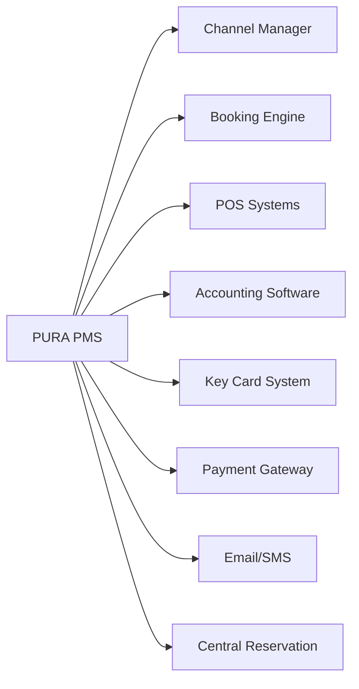

# PURA - Property Management System

## Product Requirements Document (PRD) - Enterprise Edition

---

## 1. Executive Summary

**PURA** เป็น Enterprise Cloud-based Property Management System ระดับ 5 ดาว ที่รวม **ความแข็งแกร่งของระบบ Comanche** (Night Audit, GL/AP/AR, Audit Trails) กับ **UI ที่ใช้งานง่ายของ Little Hotelier**

อิงจาก:

- การวิจัยตลาด PMS ระดับโลก (Oracle Opera Cloud, Cloudbeds, Mews, Comanche)
- มาตรฐานบัญชีโรงแรมสากล (USALI - Uniform System of Accounts for the Lodging Industry)
- Best practices สำหรับ Cloud-based SaaS PMS

### Vision

ระบบ PMS ระดับ Enterprise ที่รองรับโรงแรม 5 ดาว พร้อม Night Audit, Financial Module ครบถ้วน และ Report History

### Target Users

- โรงแรม 5 ดาว และ Luxury Resorts
- โรงแรมขนาดกลาง-ใหญ่ (50-500+ ห้อง)
- Hotel Chains & Multi-property
- MICE & Convention Hotels

---

## 2. Architecture: Web App + Hybrid Capability

### 2.1 ทำไมต้องเป็น Web App?

**ข้อดี:**

- ✅ **Accessibility:** ผู้บริหารดู Dashboard จากมือถือได้, พนักงานแม่บ้านใช้ Tablet ได้
- ✅ **No On-premise Server:** ไม่ต้องติดตั้ง Server ราคาแพงที่โรงแรม
- ✅ **Instant Updates:** อัปเดตเวอร์ชันได้ทันทีโดยไม่ต้องติดตั้ง
- ✅ **Multi-device:** ใช้งานได้จากทุกอุปกรณ์ (Desktop, Tablet, Mobile)
- ✅ **Cost-effective:** ลดค่าใช้จ่าย IT Infrastructure

**ข้อจำกัด:**

- ⚠️ **Internet Dependency:** ถ้าอินเทอร์เน็ตล่ม ระบบหยุดทำงาน
- ⚠️ **Hardware Integration:** Web Browser ทั่วไปสั่งงาน Hardware แบบ Local ได้ยาก

### 2.2 Hybrid Solution: Web App + PWA + Local Bridge

#### A. Progressive Web App (PWA)

- **Offline-first capability:** Cache ข้อมูลบางส่วนให้ทำงานต่อได้ชั่วคราวแม้อินเทอร์เน็ตหลุด
- **Installable:** ติดตั้งลงเครื่องได้เหมือนแอป
- **Background Sync:** Sync ข้อมูลเมื่อกลับมาออนไลน์

#### B. Local Device Agent (Bridge)

โปรแกรมตัวเล็กๆ (Service) ติดตั้งในคอมพิวเตอร์หน้าฟรอนต์ เพื่อเป็นตัวกลางให้ Web App สั่งงาน Hardware:

- **Printer:** สั่งพิมพ์ใบเสร็จ/Registration Card โดยไม่ต้องผ่าน Browser Dialog
- **Key Card Encoder:** ออก Key Card อัตโนมัติ (VingCard, Salto, Hafele)
- **Passport Scanner (OCR):** Auto-fill Guest Profile
- **Smart Card Reader:** อ่านบัตรประชาชนไทย

**Tech Stack สำหรับ Bridge:**

- Option 1: Electron (Node.js + Chromium) - ง่าย, ใช้ JavaScript
- Option 2: Go + Local HTTP Server - เบา, เร็ว, ปลอดภัยกว่า

---

## 3. Tech Stack 2026

```
┌─────────────────────────────────────────────────────┐
│           FRONTEND (Next.js 16 + React 19)           │
│  • Turbopack (5x faster builds)                     │
│  • React Compiler (auto-memoization)                │
│  • Tailwind CSS 4 + shadcn/ui                       │
├─────────────────────────────────────────────────────┤
│           BACKEND (Node.js + NestJS 11)              │
│  • Enterprise-ready, modular architecture           │
│  • Prisma ORM + PostgreSQL                          │
│  • Passport.js + JWT authentication                 │
│  • Swagger auto-documentation                       │
│  • Redis Queue (BullMQ) for Night Audit             │
├─────────────────────────────────────────────────────┤
│               UI THEME (Logo Colors)                 │
│  • Primary: #1E4B8E (Deep Blue)                     │
│  • Secondary: #F5A623 (Amber Orange)                │
│  • Accent: #3B82F6 (Sky Blue)                       │
└─────────────────────────────────────────────────────┘
```

### Tech Stack Refinements

| Component | Current PRD   | Suggested Upgrade                   | Reason                                            |
| --------- | ------------- | ----------------------------------- | ------------------------------------------------- |
| Frontend  | Next.js 16    | Next.js 16 (PWA Mode)               | รองรับการทำงาน Offline เบื้องต้น                  |
| Backend   | NestJS 11     | NestJS + Redis Queue                | ใช้ Queue (BullMQ) จัดการ Night Audit             |
| Database  | PostgreSQL    | PostgreSQL + TimescaleDB (Optional) | เก็บ Log/Audit Trail ระยะยาวได้ดีกว่า             |
| Printing  | Browser Print | Local Agent (Electron/Go)           | สั่งพิมพ์ใบเสร็จ/ออก Key Card โดยไม่ต้องกด Ctrl+P |
| Reporting | PDF Export    | Server-side PDF Gen (Puppeteer)     | สร้าง Report สวยงามระดับ Pixel-perfect            |
| i18n      | -             | next-intl                           | รองรับภาษาไทย-อังกฤษ                              |

---

## 4. Core Modules (24 Modules)

### 🏨 Front Office Operations

#### 4.1 Dashboard

- Real-time occupancy & revenue
- Today's arrivals, departures, in-house
- Alerts & notifications, Quick action shortcuts, Shift summary

#### 4.2 Reservation Management

- Visual calendar (drag & drop), Availability matrix
- Rate & inventory control, Overbooking & Waitlist management
- Confirmation letters (auto-generate)
- **Day-use reservations** (check-in/out same day, no Night Audit posting)
- **Split stay** (different room types within one reservation)
- **No-show handling** (auto-charge deposit per cancellation policy)
- **Late cancellation** (auto-post cancellation fee based on policy timeline)
- **Waitlist management** with auto-notify when room becomes available
- **Overbooking recovery** — Walk guest to partner hotel, track cost & compensation

#### 4.3 Front Desk

- Express check-in/check-out, Room assignment optimization
- ID/Passport scanning, Key card integration ready
- Walk-in handling, Early check-in / Late check-out
- **Room move mid-stay** — Transfer folio, re-issue key card, update housekeeping
- **VIP room pre-assignment** — Lock room for VIP, prevent auto-reassignment
- **Complimentary / House Use rooms** — Owner/Staff/Press use, count occupancy not revenue
- **Digital registration card** — Tablet signature, store digitally, legal compliance
- **Self-service kiosk integration** — Check-in/out via lobby kiosk
- **Wake-up call system** — Manual or PBX integration, track delivery confirmation

#### 4.4 Guest Profile (CRM)

- Complete guest history, Preferences & special requests
- VIP/Loyalty tiers, Blacklist management
- Revenue per guest (lifetime), Birthday/Anniversary tracking
- **Guest messaging / In-app chat** — Real-time communication during stay
- **Post-stay feedback** — Auto-survey after checkout, review management
- **Guest complaints / Service recovery** — Track issues, resolution, compensation

---

### 🔄 Daily Operations

#### 4.5 Night Audit System

```
┌─────────────────────────────────────────────────────┐
│                 NIGHT AUDIT PROCESS                  │
├─────────────────────────────────────────────────────┤
│ 1. Pre-Audit Checks                                 │
│    - Verify all postings complete                   │
│    - Check unbalanced folios                        │
│    - Validate room rates                            │
├─────────────────────────────────────────────────────┤
│ 2. Room & Rate Posting                              │
│    - Auto-post room charges                         │
│    - Post recurring charges                         │
│    - Apply packages & inclusions                    │
├─────────────────────────────────────────────────────┤
│ 3. Report Generation                                │
│    - Daily revenue report                           │
│    - Manager's report                               │
│    - Trial balance                                  │
│    - Guest ledger                                   │
├─────────────────────────────────────────────────────┤
│ 4. Day Close                                        │
│    - Roll business date                             │
│    - Archive daily data                             │
│    - Generate audit trail                           │
└─────────────────────────────────────────────────────┘
```

**Night Audit Features:**

- Automated room charge posting, Trial balance verification
- Discrepancy detection, Force-close with manager override
- Audit log with timestamps, Re-run capability for corrections
- **Queue System** (BullMQ) for background processing

**Implemented in Phase 3 (WP5):**

- **API**
  - `POST /night-audit/run` (start a run for `{ propertyId, businessDate }`)
  - `GET /night-audit/status/:propertyId/:businessDate` (poll status + errors + reports)
- **Idempotency**
  - deterministic queue job id (`night-audit:${propertyId}:${YYYY-MM-DD}`)
  - posting-level guard to prevent double room-charge for same business date
- **Persistence**
  - `NightAudit` state machine (`PENDING`/`IN_PROGRESS`/`COMPLETED`/`FAILED`)
  - `AuditError` persisted on failures
  - `ReportArchive` entry created for run summary
- **UI**
  - `/night-audit` page can trigger run and poll status

See ADRs:

- `docs/adr/001-posting-model-tax-service-split.md`
- `docs/adr/002-night-audit-idempotency-status-report-archive.md`

#### 4.6 Shift Management

- Shift open/close procedures, Cash drawer management
- Shift handover reports, Cashier reconciliation
- Variance tracking, Manager approval workflow

#### 4.7 Housekeeping

- Room status board (real-time), Task assignment by floor/section
- Cleaning schedules, Linen & minibar tracking
- Maintenance requests, Inspection checklists
- Mobile app for housekeepers
- **DND (Do Not Disturb) / MUR (Make Up Room)** status indicators
- **Inspection Workflow:** Dirty → Clean → Inspected → Ready
- **OOO vs OOS:**
  - **OOO:** ห้องเสีย ขายไม่ได้ (กระทบ Occupancy %)
  - **OOS:** ปิดชั่วคราว ขายได้ถ้าจำเป็น (ไม่กระทบ Occupancy %)
  - Maintenance tracking (วันที่เริ่มซ่อม, วันที่คาดว่าจะเสร็จ)

---

### 💰 Financial Module (Enterprise — USALI Compliant)

#### 4.8 Billing & Folio Management

- Multiple folios per reservation, Split billing (Folio Windows)
- Routing instructions, Advance deposits
- City ledger transfers, Proforma invoices, Tax invoice generation
- **Post-departure charges** — Reopen folio or post to city ledger after checkout (minibar, damage)
- **Credit limit alerts** — Auto-notify when folio balance exceeds threshold, force settlement
- **Rebate vs. Void** — Rebate = partial refund (e.g. 20% discount), Void = full cancellation
- **Auto-routing rules** — Complex routing (room charges → company, F&B → guest)
- **Package revenue breakdown** — Split inclusive rate: Room → 4000-01, F&B → 4000-02 per USALI
- **Extended stay billing** — Weekly/monthly billing cycles for long-term guests
- **Tax exemption handling** — Flag diplomatic/government guests for VAT exemption

#### 4.9 Payment Processing

```
Supported Payment Methods:
├── Cash (multi-currency)
├── Credit/Debit Cards
├── Bank Transfer
├── QR Payment (PromptPay)
├── Virtual Cards (OTA)
├── Direct Bill (AR)
├── Vouchers & Coupons
└── Cryptocurrency (future)
```

- **Credit card pre-authorization** — Hold amount (not charge) at check-in, release at checkout
- **Incremental authorization** — Extend hold for extended stays
- **Partial payments** — Apply multiple payment methods to single folio
- **Refund processing** — Full/partial refunds with approval workflow

#### 4.10 Accounts Receivable (AR)

- Company/Agent master, Credit limit management
- Invoice aging, Statement generation, Payment allocation
- Collection tracking, Bad debt write-off

#### 4.11 Accounts Payable (AP)

- Vendor management, Purchase orders, Invoice processing
- Payment scheduling, Expense tracking, Commission calculations

#### 4.12 General Ledger (GL)

- Chart of accounts (USALI structure), Journal entries (auto & manual)
- Trial balance, P&L statement, Balance sheet
- Bank reconciliation, Multi-currency handling

---

### 📊 Reports & Analytics (with History)

#### 4.13 Report Center ⭐ ENHANCED

**Daily Operations Reports:**

| Report                 | Description               |
| ---------------------- | ------------------------- |
| Manager's Report       | Daily summary for GM      |
| Night Audit Report     | End-of-day reconciliation |
| Arrival/Departure List | Daily movements           |
| In-House Guest List    | Current occupancy         |
| No-Show Report         | Failed arrivals           |
| Cancellation Report    | Cancelled bookings        |

**Revenue Reports:**

| Report                | Description                |
| --------------------- | -------------------------- |
| Revenue by Department | Breakdown by outlet        |
| ADR/RevPAR Report     | Key performance indicators |
| Rate Variance Report  | Actual vs. rack rate       |
| Forecast Report       | Future occupancy & revenue |
| Pace Report           | Booking pickup analysis    |

**Financial Reports:**

| Report             | Description              |
| ------------------ | ------------------------ |
| Trial Balance      | Daily/Monthly GL summary |
| AR Aging Report    | Outstanding receivables  |
| City Ledger Report | AR transactions          |
| Cashier Report     | Shift settlements        |
| Tax Report         | VAT summary              |

#### 4.14 Report History & Archive ⭐ NEW

```
┌─────────────────────────────────────────────────────┐
│              REPORT ARCHIVE SYSTEM                   │
├─────────────────────────────────────────────────────┤
│ • Auto-archive daily reports after Night Audit      │
│ • Store 7 years of historical data                  │
│ • Searchable by date range                          │
│ • PDF & Excel export                                │
│ • Audit trail for all generated reports             │
│ • Comparison reports (YoY, MoM)                     │
│ • Scheduled report delivery (email)                 │
└─────────────────────────────────────────────────────┘
```

---

### 🎉 Revenue & Sales

#### 4.15 Rate Management

- BAR, Seasonal/Day-of-week/LOS pricing
- Promotional, Corporate/Contracted, Package rates
- **Rate Derivation:** Parent/Child rates with formula engine
  - ระบบผูกสูตรราคา เช่น Rate B = Rate A - 10%
  - ถ้าแก้ Rate A, Rate B เปลี่ยนตามทันที
- **Rate Packages:** รวมอาหารเช้า, Spa, etc.
- **Dynamic pricing / Yield management** — AI-assisted pricing based on demand, pace, competition
- **Day-use rates** — Separate rate structure for non-overnight stays
- **Hourly rates** — For meeting rooms, day-use, airport hotels
- **Complimentary / House Use rate codes** — Zero-rate with proper statistics tracking

#### 4.16 Group & MICE Management

- Group booking wizard, Rooming list, Block allocation
- Cutoff date tracking, Group billing (master/individual)
- Meeting room scheduling, Banquet event orders (BEO)
- F&B package management
- **Allotment & Blocks:**
  - ระบบจัดการโควตาห้องให้ Agent/OTA
  - ตัดจากกองกลาง (General Inventory) หรือตัดจากโควตาเฉพาะ (Dedicated Block)
  - Cut-off date tracking, Pickup reports

---

### 🌟 Guest Services

#### 4.17 Concierge Services

- Guest requests tracking, Airport transfers, Restaurant reservations
- Tour bookings, Transportation, Special occasions, Lost & found

#### 4.18 Spa & Amenities

- Spa appointment scheduling, Treatment menu, Therapist assignment
- Package deals, Revenue tracking, Guest wellness profiles

---

### 🔒 Compliance & Automation

#### 4.19 TM30 Immigration Reporting ⭐ CRITICAL (Thailand)

- **บังคับตามกฎหมายไทย** — โรงแรมต้องรายงานแขกต่างชาติภายใน 24 ชม.
- Auto-extract passport data from scan/OCR
- Auto-generate TM30 form for submission to ตม.
- Track submission status (Pending/Submitted/Confirmed)
- Batch submission for multiple guests
- Alert for overdue submissions

#### 4.20 Lost & Found Management

- Item registration with photo evidence
- Location tracking (room, public area)
- Guest notification & claim workflow
- Disposition tracking (returned, donated, disposed)
- Retention period management

#### 4.21 Guest Communication Hub

- In-app messaging (guest ↔ hotel staff)
- Automated pre-arrival messages
- Post-stay satisfaction survey
- Review management (auto-respond to OTA reviews)
- Push notifications for service updates

---

### 🏢 Multi-Property & Chain Management

#### 4.22 Central Reservation System (CRS)

- Cross-property availability search
- Central rate management
- Guest profile sharing across properties
- Loyalty program (earn/redeem across chain)
- Central reporting & analytics dashboard

#### 4.23 Yield Management (AI-Assisted)

- Demand forecasting based on historical data
- Competitor rate monitoring
- Automated rate recommendations
- Pace analysis with alerts
- Revenue optimization suggestions

#### 4.24 Self-Service Portal

- **Kiosk check-in/out** — Lobby kiosk with ID scan + payment
- **Mobile check-in** — Pre-arrival room selection + digital key
- **Guest web portal** — View folio, request services, extend stay
- **Digital key** — Smartphone-based door access (BLE/NFC)

---

## 5. Core Concepts

### Business Date vs. System Date

- **Business Date:** วันที่ทางบัญชีโรงแรม (อาจไม่ตรงกับ System Date)
- **System Date:** วันที่จริงของระบบ
- **สำคัญ:** ธุรกรรมที่เกิดตอนตี 1 (System Time) อาจยังเป็น Business Date ของ "เมื่อวาน" ถ้ายังไม่ปิดรอบ (Night Audit)

### Folio Windows (การแยกบิล)

- แขก 1 คน ต้องมีหลาย "กระเป๋า" (Window)
  - Window 1: ค่าห้อง (บริษัทจ่าย)
  - Window 2: ส่วนตัว (แขกจ่าย)
  - Window 3: Company Master (สำหรับ Group)

### Immutable Transactions

- **ห้าม UPDATE ตาราง Transaction เด็ดขาด**
- ถ้าผิดต้องสร้าง Transaction ใหม่มาหักล้าง (Correction/Void)
- เก็บ Audit Trail ครบถ้วน
- บังคับ Reason Code ทุกครั้งที่ Void/Adjustment

### Share-with / Accompanying Guest

- ฟังก์ชันแขกพักหลายคนในห้องเดียว แต่ต้องการแยก Profile หรือแยกบิลกัน
- ไม่ใช่แค่ใส่ชื่อใน Remark

### Day-use vs. Overnight

- **Day-use:** Check-in/out ภายในวันเดียว ไม่ผ่าน Night Audit
- ต้อง flag เป็น Day-use เพื่อไม่ post room charge ตอน Night Audit
- Rate structure แยกจาก overnight

### Room Move Process

- เมื่อแขกย้ายห้อง ระบบต้อง:
  1. Transfer folio ไปห้องใหม่
  2. Re-issue key card
  3. Update housekeeping status (ห้องเก่า → Dirty, ห้องใหม่ → Occupied)
  4. Track ประวัติการย้ายทั้งหมด

### Credit Card Pre-authorization

- **Pre-auth ≠ Charge** — Hold วงเงินโดยไม่หักจริง
- Auto-calculate hold amount: (room rate × nights) + estimated incidentals
- Release hold เมื่อ checkout หรือ full payment
- Incremental auth สำหรับ extend stay

### No-show & Cancellation Policy

- ทุก rate code ต้อง link กับ cancellation policy
- Auto-post no-show charge เมื่อ Night Audit ถ้าไม่มี check-in
- Timeline: Free cancel → Late cancel fee → Full no-show charge

### Post-departure Charges

- ค่าใช้จ่ายที่เจอหลัง checkout (minibar, damage)
- สร้าง "Post" folio → ส่งบิลให้แขก หรือ charge บัตร (ถ้ามี auth)
- ถ้าไม่ได้ → transfer to city ledger (AR)

### Tax Exemption

- แขกทูต, ราชการ, องค์กรระหว่างประเทศ
- Flag ใน reservation → folio ไม่คิด VAT
- ต้องเก็บเอกสารยกเว้นภาษี

### Extended Stay / Long-term Guest

- แขกพักเป็นสัปดาห์/เดือน
- Billing cycle: weekly หรือ monthly (ไม่ใช่ per night)
- Rate structure แยก: daily vs. weekly vs. monthly
- Auto-generate interim folio ตาม cycle

## 6. Database Schema (Enterprise)

### 6.1 Enums

```prisma
enum TrxType {
  CHARGE
  PAYMENT
  ADJUSTMENT
  TRANSFER
  DEPOSIT
  REFUND
}

enum TrxGroup {
  ROOM
  FOOD
  BEVERAGE
  SPA
  FITNESS
  LAUNDRY
  TELEPHONE
  INTERNET
  MINIBAR
  PARKING
  MISC
  TAX
  SERVICE
  DISCOUNT
}

enum FolioStatus {
  OPEN
  CLOSED
  POSTED_TO_CITY_LEDGER
  TRANSFERRED
}

enum ReasonCategory {
  VOID
  DISCOUNT
  ADJUSTMENT
  TRANSFER
  COMPLIMENTARY
  STAFF
  OTHER
}
```

### 6.2 Financial Schema

```prisma
// ==================== TRANSACTION CODES ====================
// ผังบัญชีฝั่ง PMS - เชื่อมโยง PMS Operation เข้ากับ GL Account
model TransactionCode {
  id            String   @id @default(cuid())
  code          String   @unique // e.g., "1000" (Room Charge), "9000" (Cash)
  description   String
  descriptionTh String? // ภาษาไทย
  type          TrxType  // CHARGE, PAYMENT, ADJUSTMENT
  group         TrxGroup // ROOM, FOOD, BEVERAGE, SPA, MISC, TAX, SERVICE

  // Tax & Service Charge Logic
  hasTax        Boolean  @default(true)
  hasService    Boolean  @default(true)
  taxId         String?  // Link to Tax configuration
  serviceRate   Decimal? @default(10.00) @db.Decimal(5, 2) // Service Charge %

  // Mapping to GL (สำคัญสำหรับ Export บัญชี)
  glAccountCode String   // e.g., "4000-01" (Revenue-Room)
  departmentCode String? // สำหรับ USALI

  transactions  FolioTransaction[]
  createdAt     DateTime @default(now())
  updatedAt     DateTime @updatedAt
}

// ==================== FOLIO ENHANCEMENT ====================
model Folio {
  id            String        @id @default(cuid())
  folioNumber   String        @unique
  reservationId String?
  reservation   Reservation?  @relation(fields: [reservationId], references: [id])
  type          FolioType     @default(GUEST)
  status        FolioStatus   @default(OPEN)

  // Balance caching (เพื่อความเร็ว Dashboard)
  balance       Decimal       @default(0.00) @db.Decimal(12, 2)

  // Business Date tracking
  businessDate  DateTime      @db.Date

  windows       FolioWindow[]
  transactions  FolioTransaction[]
  createdAt     DateTime      @default(now())
  closedAt      DateTime?
  closedBy      String?
}

// ==================== FOLIO WINDOW (การแยกบิล) ====================
model FolioWindow {
  id           String             @id @default(cuid())
  folioId      String
  folio        Folio              @relation(fields: [folioId], references: [id], onDelete: Cascade)
  windowNumber Int                // 1, 2, 3, 4
  description  String?            // e.g. "Personal Expenses", "Company Charges"
  balance      Decimal            @default(0.00) @db.Decimal(12, 2)
  transactions FolioTransaction[]
  createdAt    DateTime           @default(now())
  @@unique([folioId, windowNumber])
}

// ==================== FOLIO TRANSACTION (ตารางที่ใหญ่และสำคัญที่สุด) ====================
// เก็บทุกความเคลื่อนไหวทางการเงิน ห้ามลบ ห้ามแก้!
model FolioTransaction {
  id            String   @id @default(cuid())
  windowId      String
  window        FolioWindow @relation(fields: [windowId], references: [id])
  trxCodeId     String
  trxCode       TransactionCode @relation(fields: [trxCodeId], references: [id])

  // Dates are Critical
  businessDate  DateTime @db.Date // วันที่ทางบัญชีโรงแรม
  createdAt     DateTime @default(now()) // วันที่บันทึกจริง (System timestamp)

  // Money (ต้องเก็บละเอียด แยก Vat/Service)
  amountNet     Decimal  @db.Decimal(12, 2) // ราคาก่อนภาษี/Service
  amountService Decimal  @default(0) @db.Decimal(12, 2) // Service Charge 10%
  amountTax     Decimal  @default(0) @db.Decimal(12, 2) // VAT 7%
  amountTotal   Decimal  @db.Decimal(12, 2) // Net + Svc + Tax

  // Sign (Charge = +, Payment = -)
  sign          Int      // 1 or -1

  // Reference & Audit
  reference     String?  // e.g., "Room 101", "Check #1234", "POS-001"
  remark        String?
  userId        String   // ใครเป็นคนทำรายการ
  shiftId       String?  // ทำในกะไหน
  nightAuditId  String?  // ถูกปิดรอบไปหรือยัง (ถ้ามีค่า = ห้ามแตะต้องแล้ว)

  // Reason Code (บังคับสำหรับ Void/Adjustment)
  reasonCodeId  String?
  reasonCode    ReasonCode? @relation(fields: [reasonCodeId], references: [id])

  // Correction linkage
  relatedTrxId  String?  // ถ้าเป็นการ Void, Link กลับไปที่รายการเดิม
  isVoid        Boolean  @default(false)
  voidedAt      DateTime?
  voidedBy      String?

  // Indexes for performance
  @@index([businessDate])
  @@index([windowId, businessDate])
  @@index([nightAuditId])
  @@index([trxCodeId])
}

// ==================== REASON CODES ====================
// บังคับให้ user เลือก "เหตุผล" ทุกครั้งที่มีการ Void, Discount, หรือ Move Transaction
model ReasonCode {
  id          String   @id @default(cuid())
  code        String   @unique
  description String
  descriptionTh String?
  category    ReasonCategory
  isActive    Boolean  @default(true)
  transactions FolioTransaction[]
  createdAt   DateTime @default(now())
}

// ==================== ROUTING INSTRUCTIONS ====================
// การโยนบิลอัตโนมัติ (เช่น "โยนค่าห้อง (Trx 1000) ไปเข้า Window 2 ของ Group Master")
model RoutingInstruction {
  id            String   @id @default(cuid())
  sourceFolioId String
  targetFolioId String
  targetWindow  Int

  trxCodes      String[] // Array of TrxCodes to route (e.g. ["1000", "2000"])
  dateFrom      DateTime @db.Date
  dateTo        DateTime @db.Date
  isActive      Boolean  @default(true)
  createdAt     DateTime @default(now())
}

// ==================== DEPOSIT LEDGER ====================
// เงินมัดจำที่รับมาก่อนแขกเข้าพัก (ยังไม่ถือเป็น Revenue จนกว่าจะ Check-in)
model Deposit {
  id            String   @id @default(cuid())
  reservationId String
  reservation   Reservation @relation(fields: [reservationId], references: [id])
  amount        Decimal  @db.Decimal(12, 2)
  currency      String   @default("THB")
  exchangeRate  Decimal? @db.Decimal(10, 4) // ถ้าจ่ายด้วยสกุลอื่น
  method        PaymentMethod
  receivedAt    DateTime @default(now())
  receivedBy    String
  reference     String?
  notes         String?
  // เมื่อ Check-in จะโอนไปเป็น Payment ใน Folio
  transferredToFolio Boolean @default(false)
  transferredAt      DateTime?
}

// ==================== CURRENCY EXCHANGE ====================
model ExchangeRate {
  id            String   @id @default(cuid())
  baseCurrency  String   @default("THB")
  targetCurrency String
  rate          Decimal  @db.Decimal(10, 4)
  effectiveDate DateTime @db.Date
  isActive      Boolean  @default(true)
  createdAt     DateTime @default(now())
  @@unique([baseCurrency, targetCurrency, effectiveDate])
}

// ==================== TAX INVOICE (ใบกำกับภาษีเต็มรูป) ====================
model TaxInvoice {
  id            String   @id @default(cuid())
  invoiceNumber String   @unique // Running Number ต้องเป๊ะ ห้ามข้าม
  folioId       String?
  reservationId String?
  businessDate  DateTime @db.Date

  // Taxpayer Info
  taxId         String   // เลขประจำตัวผู้เสียภาษี
  branchNumber  String?  // สาขา

  // Amounts
  amountNet     Decimal  @db.Decimal(12, 2)
  amountTax     Decimal  @db.Decimal(12, 2)
  amountTotal   Decimal  @db.Decimal(12, 2)

  // e-Tax Invoice
  eTaxInvoiceId String?  // ID จากกรมสรรพากร (ถ้ามี)
  qrCode        String?  // QR Code สำหรับ e-Tax Invoice

  // Status
  status        InvoiceStatus @default(OPEN)
  issuedAt      DateTime?
  issuedBy      String?
  createdAt     DateTime @default(now())
}

// ==================== FIXED CHARGES (Recurring) ====================
// รายการที่จะ Post อัตโนมัติทุกคืนนอกจากค่าห้อง
model FixedCharge {
  id            String   @id @default(cuid())
  reservationId String
  reservation   Reservation @relation(fields: [reservationId], references: [id])
  trxCodeId     String
  trxCode       TransactionCode @relation(fields: [trxCodeId], references: [id])
  amount        Decimal  @db.Decimal(12, 2)
  description   String
  startDate     DateTime @db.Date
  endDate       DateTime @db.Date
  isActive      Boolean  @default(true)
  posted        Boolean  @default(false) // ถูก Post แล้วหรือยัง
  createdAt     DateTime @default(now())
}
```

### 6.3 Operations Schema

```prisma
// ==================== NIGHT AUDIT ====================
model NightAudit {
  id            String   @id @default(cuid())
  businessDate  DateTime
  status        AuditStatus
  startedAt     DateTime
  completedAt   DateTime?
  performedBy   String
  notes         String?
  reports       AuditReport[]
  errors        AuditError[]
}

model AuditReport {
  id            String   @id @default(cuid())
  nightAuditId  String
  nightAudit    NightAudit @relation(fields: [nightAuditId], references: [id])
  reportType    String
  reportData    Json
  generatedAt   DateTime @default(now())
}

// ==================== REPORT ARCHIVE ====================
model ReportArchive {
  id            String   @id @default(cuid())
  reportType    String
  businessDate  DateTime
  parameters    Json?
  data          Json
  pdfUrl        String?
  excelUrl      String?
  generatedBy   String
  generatedAt   DateTime @default(now())
  @@index([reportType, businessDate])
}

// ==================== GENERAL LEDGER ====================
model GLAccount {
  id            String   @id @default(cuid())
  code          String   @unique
  name          String
  type          AccountType
  parentId      String?
  balance       Decimal  @default(0)
}

model JournalEntry {
  id            String   @id @default(cuid())
  entryDate     DateTime
  reference     String
  description   String
  lines         JournalLine[]
  postedBy      String
  createdAt     DateTime @default(now())
}

// ==================== ACCOUNTS RECEIVABLE ====================
model ARAccount {
  id            String   @id @default(cuid())
  companyName   String
  creditLimit   Decimal
  currentBalance Decimal @default(0)
  invoices      Invoice[]
}

// ==================== SHIFT MANAGEMENT ====================
model Shift {
  id            String   @id @default(cuid())
  userId        String
  startTime     DateTime
  endTime       DateTime?
  openingCash   Decimal
  closingCash   Decimal?
  status        ShiftStatus
  transactions  FolioTransaction[]
}

// ==================== AUDIT TRAIL ====================
model AuditLog {
  id            String   @id @default(cuid())
  userId        String
  action        String
  entityType    String
  entityId      String
  oldValue      Json?
  newValue      Json?
  ipAddress     String?
  userAgent     String?
  timestamp     DateTime @default(now())
  @@index([entityType, entityId])
  @@index([userId, timestamp])
}
```

### 6.4 Edge Case Schema

```prisma
// ==================== TM30 IMMIGRATION ====================
model TM30Report {
  id            String   @id @default(cuid())
  guestId       String
  guest         Guest    @relation(fields: [guestId], references: [id])
  reservationId String
  passportNumber String
  nationality   String
  arrivalDate   DateTime @db.Date
  departureDate DateTime? @db.Date
  status        TM30Status // PENDING, SUBMITTED, CONFIRMED, FAILED
  submittedAt   DateTime?
  confirmedAt   DateTime?
  referenceNo   String?  // เลขอ้างอิงจาก ตม.
  submittedBy   String?
  createdAt     DateTime @default(now())
  @@index([guestId])
  @@index([status])
}

enum TM30Status {
  PENDING
  SUBMITTED
  CONFIRMED
  FAILED
}

// ==================== LOST & FOUND ====================
model LostFoundItem {
  id            String   @id @default(cuid())
  itemDescription String
  locationFound String
  roomNumber    String?
  foundBy       String
  foundDate     DateTime
  photoUrl      String?
  guestId       String?  // ถ้าทราบว่าของใคร
  status        LostFoundStatus // FOUND, CLAIMED, RETURNED, DISPOSED
  claimedAt     DateTime?
  claimedBy     String?
  disposedAt    DateTime?
  retentionDays Int      @default(90)
  createdAt     DateTime @default(now())
}

enum LostFoundStatus {
  FOUND
  CLAIMED
  RETURNED
  DISPOSED
}

// ==================== CARD AUTHORIZATION ====================
model CardAuthorization {
  id            String   @id @default(cuid())
  reservationId String
  folioId       String?
  cardLast4     String
  cardType      String   // VISA, MASTERCARD, AMEX, JCB
  authCode      String
  amount        Decimal  @db.Decimal(12, 2)
  currency      String   @default("THB")
  status        AuthStatus // AUTHORIZED, CAPTURED, RELEASED, EXPIRED
  authorizedAt  DateTime
  expiresAt     DateTime
  capturedAt    DateTime?
  releasedAt    DateTime?
  createdAt     DateTime @default(now())
  @@index([reservationId])
}

enum AuthStatus {
  AUTHORIZED
  CAPTURED
  RELEASED
  EXPIRED
}

// ==================== NO-SHOW POLICY ====================
model CancellationPolicy {
  id            String   @id @default(cuid())
  name          String
  description   String?
  freeCancelHours Int    @default(24) // ก่อน check-in กี่ชม. cancel ฟรี
  lateCancelCharge Decimal @db.Decimal(5, 2) // % of first night
  noShowCharge  Decimal  @db.Decimal(5, 2) // % of first night
  isDefault     Boolean  @default(false)
  isActive      Boolean  @default(true)
}

// ==================== ROOM MOVE ====================
model RoomMove {
  id            String   @id @default(cuid())
  reservationId String
  fromRoomId    String
  toRoomId      String
  reason        String?
  movedAt       DateTime @default(now())
  movedBy       String
  keyCardReissued Boolean @default(false)
  folioTransferred Boolean @default(false)
}

// ==================== GUEST MESSAGING ====================
model GuestMessage {
  id            String   @id @default(cuid())
  reservationId String?
  guestId       String
  direction     MessageDirection // INBOUND, OUTBOUND
  channel       MessageChannel   // IN_APP, SMS, EMAIL, WHATSAPP
  content       String
  sentBy        String?  // staff userId if outbound
  readAt        DateTime?
  createdAt     DateTime @default(now())
  @@index([guestId, createdAt])
}

enum MessageDirection {
  INBOUND
  OUTBOUND
}

enum MessageChannel {
  IN_APP
  SMS
  EMAIL
  WHATSAPP
}
```

### 6.5 Reservation Model Updates

ต้องอัปเดต `Reservation` model เพื่อรองรับ:

```prisma
model Reservation {
  // ... existing fields ...
  fixedCharges  FixedCharge[]
  deposits      Deposit[]
  taxInvoices   TaxInvoice[]
}
```

---

## 7. USALI Compliance

### Chart of Accounts Structure

GL Account ต้องจัดหมวดหมู่ตามมาตรฐาน USALI:

```
4000 - REVENUE
  4000-01 - Room Revenue
  4000-02 - Food Revenue
  4000-03 - Beverage Revenue
  4000-04 - Spa Revenue
  4000-05 - Other Revenue

5000 - COST OF SALES
  5000-01 - Food Cost
  5000-02 - Beverage Cost

6000 - OPERATING EXPENSES
  6000-01 - Salaries & Wages
  6000-02 - Utilities
  6000-03 - Marketing
```

### Reports ที่ต้องรองรับ USALI

- **P&L Statement:** ตามรูปแบบ USALI
- **Departmental Reports:** แยกตาม Department (Room, F&B, Spa, etc.)
- **Market Segment Reports:** แยกตาม Market Segment (Corporate, Leisure, Group, etc.)
- **RevPAR, ADR calculations**

---

## 8. Integrations



| Integration     | Current Priority | Updated Priority | Reason                                                                     |
| --------------- | ---------------- | ---------------- | -------------------------------------------------------------------------- |
| Channel Manager | High             | High             | OTA connectivity & rate sync                                               |
| Booking Engine  | High             | High             | Direct bookings                                                            |
| POS (F&B)       | High             | High             | Restaurant charges                                                         |
| Payment Gateway | High             | High             | Card processing (Omise/Stripe/2C2P)                                        |
| Key Card System | Medium           | **High**         | Critical สำหรับ 5 ดาว - ต้องทำ Interface เชื่อมกับ VingCard, Salto, Hafele |
| Hardware Bridge | -                | **High**         | จำเป็นสำหรับ Printer, Passport Scanner, Smart Card Reader                  |
| e-Tax Invoice   | -                | **High**         | จำเป็นสำหรับโรงแรมในไทย                                                    |
| Accounting      | Medium           | Medium           | GL export                                                                  |
| Guest Comm.     | Medium           | Medium           | Email/SMS                                                                  |

---

## 9. Internationalization (i18n)

### 9.1 ทำไมต้องทำ Bilingual?

#### กฎหมายและภาษี

- ใบกำกับภาษี (Tax Invoice) และ ใบเสร็จรับเงิน (Receipt) ในไทย จำเป็นต้องมีภาษาไทย
- หรือเป็น ไทย-อังกฤษ คู่กัน เพื่อความถูกต้องทางสรรพากร

#### หน้างานจริง (Operational Level)

- **Front Office (5 ดาว):** ส่วนใหญ่ใช้ English เป็นหลักได้
- **Housekeeping & Maintenance:** จำเป็นต้องมีภาษาไทย 100% เพราะระดับปฏิบัติการอาจไม่คล่องภาษาอังกฤษ

#### จุดขาย (Selling Point)

- การเป็น "Thai-based Software" ที่เข้าใจภาษาไทยและบริบทไทย คือจุดแข็ง

### 9.2 Development Strategy

#### Phase 1: Foundation (โครงสร้าง)

- **Coding:** ห้าม Hardcode Text ลงใน Code เด็ดขาด!
- ใช้ Library i18n (next-intl สำหรับ Next.js 16 App Router)
- เขียน key เช่น `{t('login.username')}` แทนคำว่า "Username"
- **Database:** ต้องเป็น UTF-8 หรือ UTF-8MB4 เพื่อรองรับชื่อแขกภาษาไทย

#### Phase 2: UI Translation (การแปลหน้าจอ)

- **Admin / Management / Setup:** English Only ไปก่อนได้
- **Front Desk:** English เป็นหลัก (แต่รองรับการพิมพ์ชื่อไทย)
- **Housekeeping / Mobile App:** ควรทำ Thai Translation ตั้งแต่แรก

### 9.3 สิ่งที่ต้อง "รองรับไทย" ทันที

#### เอกสาร (Reports & Forms)

- Registration Card (ใบลงทะเบียนผู้เข้าพัก)
- Tax Invoice / Receipt / Folio

#### ข้อมูล Input (Data Entry)

- ชื่อ-นามสกุลแขก, ที่อยู่ (สำหรับการออกบิล), Remark / Note พิเศษ

#### การค้นหา (Search)

- ต้องค้นหาชื่อแขกด้วยภาษาไทยได้ ("สมชาย", "วิภาวี")

### 9.4 Technical Implementation

- **Library:** `next-intl` (App Router compatible)
- **Fonts:** Google Fonts: Prompt หรือ Sarabun (สำหรับภาษาไทย)
- **Strategy:** ห้าม Hardcode text → ใช้ `{t('key')}`

**Messages Structure:**

```
/messages
  en.json  <-- เริ่มทำไฟล์นี้ก่อน
  th.json  <-- ค่อยมาเติมทีหลัง หรือใช้ AI ช่วยแปลได้ง่ายๆ
```

---

## 10. Architecture & Performance

### 10.1 Database Scaling

**ปัญหา:** Prisma อาจจะช้าถ้า Query ซับซ้อนสำหรับ Night Audit และ Historical Report 7 ปี

**แนะนำ:**

- แยก Read Replica สำหรับการออก Report โดยเฉพาะ
- ใช้ Raw SQL ในส่วนที่คำนวณเงินซับซ้อน (GL/Trial Balance) เพื่อประสิทธิภาพสูงสุด
- ใช้ TimescaleDB (Optional) สำหรับเก็บ Log/Audit Trail ระยะยาว

### 10.2 Audit Trail แบบละเอียด

**ปัจจุบัน:** เก็บแค่ oldValue/newValue ใน JSON

**เพิ่ม:**

- บันทึก "Sequence" ของการแก้ไขบิล (Folio)
- บังคับให้ใส่ "Reason Code" ทุกครั้งที่มีการแก้ไข Transaction ทางการเงิน
- เก็บ IP Address, User Agent, Timestamp ครบถ้วน

### 10.3 Queue System for Night Audit

**ปัญหา:** Night Audit อาจทำให้ Web ค้างถ้า Process ใหญ่

**แนะนำ:**

- ใช้ Redis Queue (BullMQ) จัดการ Night Audit
- Process ใน Background
- แจ้งเตือนเมื่อเสร็จ

---

## 11. User Roles (Enterprise)

| Role                        | Access Level                 |
| --------------------------- | ---------------------------- |
| **System Admin**            | Full system + configuration  |
| **General Manager**         | All operations + all reports |
| **Front Office Manager**    | FO operations + FO reports   |
| **Night Auditor**           | Night audit + daily reports  |
| **Front Desk Agent**        | Check-in/out, reservations   |
| **Cashier**                 | Payments, shift management   |
| **Reservations**            | Bookings, rates              |
| **Housekeeping Supervisor** | HK management                |
| **Housekeeper**             | Room status updates only     |
| **Accountant**              | Financial module + reports   |
| **Revenue Manager**         | Rates, forecasting           |
| **Concierge**               | Guest services               |
| **Spa Reception**           | Spa bookings                 |

---

## 12. Implementation Phases

### Phase 1: Core Foundation ✅ Complete

- [x] Project setup & architecture (Monorepo, Next.js 16, NestJS 11)
- [x] Authentication & authorization (JWT)
- [x] Property & room setup
- [x] Basic reservations
- [x] Guest profiles (CRM)
- [x] Dashboard (Real-time stats)

### Phase 2: Front Office ✅ Complete

- [x] Check-in/out workflow
- [x] Folio management (Basic)
- [x] Payment processing (Basic)
- [x] Housekeeping module (Basic)
- [x] **Mock API for Frontend Demo** (CRUD all modules)

### Phase 3: Financial & Audit (Next — 🎯 Priority)

- [ ] Enhanced Folio System (Windows, Routing, Post-departure, Rebate)
- [ ] Transaction Codes (Mapping to GL)
- [ ] Reason Codes (Audit Trail)
- [ ] Night Audit System (Enhanced with Queue)
- [ ] Shift Management (Enhanced)
- [ ] GL/AR/AP modules (USALI Compliant)
- [ ] Tax Invoice (e-Tax Invoice Ready)
- [ ] Currency Exchange
- [ ] Credit Card Pre-authorization
- [ ] Package Revenue Breakdown (USALI split)
- [ ] Credit Limit Alerts & Auto-settlement

### Phase 4: Operations Edge Cases

- [ ] Day-use Reservations
- [ ] Split Stay
- [ ] Room Move Mid-stay
- [ ] No-show / Late Cancellation Auto-charges
- [ ] Post-departure Charges
- [ ] Overbooking Recovery (Walk)
- [ ] Complimentary / House Use Rooms
- [ ] Extended Stay Billing (weekly/monthly)
- [ ] Tax Exemption Handling
- [ ] VIP Room Pre-assignment & Lock

### Phase 5: Advanced Features

- [ ] Rate Derivation (Parent/Child Rates)
- [ ] Dynamic Pricing / Yield Management (AI)
- [ ] Allotment & Blocks
- [ ] Housekeeping Inspection (Workflow)
- [ ] Hardware Bridge (Local Agent)
- [ ] PWA (Offline Capability)
- [ ] Digital Registration Card (Tablet Signature)
- [ ] Wake-up Call System
- [ ] DND/MUR Status Indicators

### Phase 6: Compliance & Communication

- [ ] **TM30 Immigration Reporting** (บังคับตามกฎหมาย)
- [ ] Lost & Found Management
- [ ] Guest Communication Hub (In-app messaging)
- [ ] Post-stay Feedback & Review Management
- [ ] Guest Complaints / Service Recovery
- [ ] Self-service Kiosk Integration

### Phase 7: i18n & Multi-Property

- [ ] i18n Foundation (next-intl setup)
- [ ] Thai Translation (Critical Pages)
- [ ] Thai Font Support (PDF Reports)
- [ ] Thai Search (Guest Name Search)
- [ ] Central Reservation System (Multi-property)
- [ ] Guest Portal (View folio, request services)
- [ ] Digital Key (BLE/NFC)
- [ ] Mobile Check-in

---

## 13. Database Migration Plan

### Step 1: Add New Models

1. TransactionCode
2. FolioWindow
3. FolioTransaction (Enhanced)
4. ReasonCode
5. RoutingInstruction
6. Deposit
7. ExchangeRate
8. TaxInvoice
9. FixedCharge

### Step 2: Migrate Existing Data

- สร้าง TransactionCode สำหรับ Transaction ที่มีอยู่
- แปลง Folio เดิมให้มี Window 1 (Default)
- Migrate Transaction เดิมไปเป็น FolioTransaction

### Step 3: Update Application Code

- อัปเดต Folio Service ให้รองรับ Windows
- อัปเดต Transaction Service ให้ใช้ TransactionCode
- เพิ่ม Reason Code validation

---

## 14. Technical Requirements

### Performance

- Page load: < 1.5 seconds
- Night Audit completion: < 5 minutes
- Report generation: < 10 seconds
- Concurrent users: 500+

### Security & Compliance

- PCI-DSS for payments, GDPR/PDPA for guest data
- SOC 2 Type II
- Complete audit trails, Data encryption (at rest & transit)
- 2FA for sensitive operations

### Data Retention

- Transaction data: 7 years
- Report archives: 7 years
- Audit logs: 7 years
- Guest data: Per privacy policy

---

## 15. Success Metrics

| Metric            | Target      | Notes                            |
| ----------------- | ----------- | -------------------------------- |
| Night Audit time  | < 5 minutes | ใช้ Queue System                 |
| Check-in time     | < 2 minutes | รองรับ Hardware Integration      |
| Report accuracy   | 100%        | USALI Compliant                  |
| System uptime     | 99.9%       | Cloud-based + Offline Capability |
| Lighthouse Scores | 100/100     | All categories                   |
| i18n Coverage     | 80%         | Critical pages in Thai           |
| User satisfaction | > 4.5/5     |                                  |

---

**Document Version:** 3.2 (Enterprise Edition — 24 Modules, All Edge Cases)
**Last Updated:** February 2026
**หมายเหตุ:** เอกสารนี้เป็น Living Document จะอัปเดตตามความคืบหน้าของโปรเจกต์
