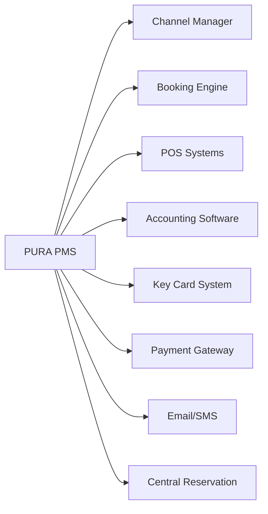

# PURA - Property Management System

## Product Requirements Document (PRD) - Enterprise Edition

---

## 1. Executive Summary

**PURA** เป็น Enterprise Cloud-based Property Management System ระดับ 5 ดาว ที่รวม **ความแข็งแกร่งของระบบ Comanche** (Night Audit, GL/AP/AR, Audit Trails) กับ **UI ที่ใช้งานง่ายของ Little Hotelier**

### Vision

ระบบ PMS ระดับ Enterprise ที่รองรับโรงแรม 5 ดาว พร้อม Night Audit, Financial Module ครบถ้วน และ Report History

### Target Users

- โรงแรม 5 ดาว และ Luxury Resorts
- โรงแรมขนาดกลาง-ใหญ่ (50-500+ ห้อง)
- Hotel Chains & Multi-property
- MICE & Convention Hotels

---

## 2. Tech Stack 2026

```
┌─────────────────────────────────────────────────────┐
│           FRONTEND (Next.js 16 + React 19)           │
│  • Turbopack (5x faster builds)                     │
│  • React Compiler (auto-memoization)                │
│  • Tailwind CSS 4 + shadcn/ui                       │
├─────────────────────────────────────────────────────┤
│           BACKEND (Node.js + NestJS 11)              │
│  • Enterprise-ready, modular architecture           │
│  • Prisma ORM + PostgreSQL                          │
│  • Passport.js + JWT authentication                 │
│  • Swagger auto-documentation                       │
├─────────────────────────────────────────────────────┤
│               UI THEME (Logo Colors)                 │
│  • Primary: #1E4B8E (Deep Blue)                     │
│  • Secondary: #F5A623 (Amber Orange)                │
│  • Accent: #3B82F6 (Sky Blue)                       │
└─────────────────────────────────────────────────────┘
```

---

## 3. Core Modules (18 Modules)

### 🏨 Front Office Operations

#### 3.1 Dashboard

- Real-time occupancy & revenue
- Today's arrivals, departures, in-house
- Alerts & notifications
- Quick action shortcuts
- Shift summary

#### 3.2 Reservation Management

- Visual calendar (drag & drop)
- Availability matrix
- Rate & inventory control
- Overbooking management
- Waitlist management
- Confirmation letters (auto-generate)

#### 3.3 Front Desk

- Express check-in/check-out
- Room assignment optimization
- ID/Passport scanning
- Key card integration ready
- Walk-in handling
- Early check-in / Late check-out

#### 3.4 Guest Profile (CRM)

- Complete guest history
- Preferences & special requests
- VIP/Loyalty tiers
- Blacklist management
- Revenue per guest (lifetime)
- Birthday/Anniversary tracking

---

### 🔄 Daily Operations

#### 3.5 Night Audit System ⭐ NEW

```
┌─────────────────────────────────────────────────────┐
│                 NIGHT AUDIT PROCESS                  │
├─────────────────────────────────────────────────────┤
│ 1. Pre-Audit Checks                                  │
│    - Verify all postings complete                   │
│    - Check unbalanced folios                        │
│    - Validate room rates                            │
├─────────────────────────────────────────────────────┤
│ 2. Room & Rate Posting                              │
│    - Auto-post room charges                         │
│    - Post recurring charges                         │
│    - Apply packages & inclusions                    │
├─────────────────────────────────────────────────────┤
│ 3. Report Generation                                 │
│    - Daily revenue report                           │
│    - Manager's report                               │
│    - Trial balance                                  │
│    - Guest ledger                                   │
├─────────────────────────────────────────────────────┤
│ 4. Day Close                                         │
│    - Roll business date                             │
│    - Archive daily data                             │
│    - Generate audit trail                           │
└─────────────────────────────────────────────────────┘
```

**Night Audit Features:**

- Automated room charge posting
- Trial balance verification
- Discrepancy detection
- Force-close with manager override
- Audit log with timestamps
- Re-run capability for corrections

#### 3.6 Shift Management ⭐ NEW

- Shift open/close procedures
- Cash drawer management
- Shift handover reports
- Cashier reconciliation
- Variance tracking
- Manager approval workflow

#### 3.7 Housekeeping

- Room status board (real-time)
- Task assignment by floor/section
- Cleaning schedules
- Linen & minibar tracking
- Maintenance requests
- Inspection checklists
- Mobile app for housekeepers

---

### 💰 Financial Module (Enterprise)

#### 3.8 Billing & Folio Management

- Multiple folios per reservation
- Split billing
- Routing instructions
- Advance deposits
- City ledger transfers
- Proforma invoices
- Tax invoice generation

#### 3.9 Payment Processing

```
Supported Payment Methods:
├── Cash (multi-currency)
├── Credit/Debit Cards
├── Bank Transfer
├── QR Payment (PromptPay)
├── Virtual Cards (OTA)
├── Direct Bill (AR)
├── Vouchers & Coupons
└── Cryptocurrency (future)
```

#### 3.10 Accounts Receivable (AR) ⭐ NEW

- Company/Agent master
- Credit limit management
- Invoice aging
- Statement generation
- Payment allocation
- Collection tracking
- Bad debt write-off

#### 3.11 Accounts Payable (AP) ⭐ NEW

- Vendor management
- Purchase orders
- Invoice processing
- Payment scheduling
- Expense tracking
- Commission calculations

#### 3.12 General Ledger (GL) ⭐ NEW

- Chart of accounts
- Journal entries (auto & manual)
- Trial balance
- P&L statement
- Balance sheet
- Bank reconciliation
- Multi-currency handling

---

### 📊 Reports & Analytics (with History)

#### 3.13 Report Center ⭐ ENHANCED

**Daily Operations Reports:**
| Report | Description |
|--------|-------------|
| Manager's Report | Daily summary for GM |
| Night Audit Report | End-of-day reconciliation |
| Arrival/Departure List | Daily movements |
| In-House Guest List | Current occupancy |
| No-Show Report | Failed arrivals |
| Cancellation Report | Cancelled bookings |

**Revenue Reports:**
| Report | Description |
|--------|-------------|
| Revenue by Department | Breakdown by outlet |
| ADR/RevPAR Report | Key performance indicators |
| Rate Variance Report | Actual vs. rack rate |
| Forecast Report | Future occupancy & revenue |
| Pace Report | Booking pickup analysis |

**Financial Reports:**
| Report | Description |
|--------|-------------|
| Trial Balance | Daily/Monthly GL summary |
| AR Aging Report | Outstanding receivables |
| City Ledger Report | AR transactions |
| Cashier Report | Shift settlements |
| Tax Report | VAT summary |

#### 3.14 Report History & Archive ⭐ NEW

```
┌─────────────────────────────────────────────────────┐
│              REPORT ARCHIVE SYSTEM                   │
├─────────────────────────────────────────────────────┤
│ • Auto-archive daily reports after Night Audit      │
│ • Store 7 years of historical data                  │
│ • Searchable by date range                          │
│ • PDF & Excel export                                │
│ • Audit trail for all generated reports             │
│ • Comparison reports (YoY, MoM)                     │
│ • Scheduled report delivery (email)                 │
└─────────────────────────────────────────────────────┘
```

---

### 🎉 Revenue & Sales

#### 3.15 Rate Management

- BAR (Best Available Rate)
- Seasonal pricing
- Day-of-week rates
- Length of stay pricing
- Promotional rates
- Corporate/Contracted rates
- Package rates

#### 3.16 Group & MICE Management ⭐ NEW

- Group booking wizard
- Rooming list management
- Block allocation
- Cutoff date tracking
- Group billing (master/individual)
- Meeting room scheduling
- Banquet event orders (BEO)
- F&B package management

---

### 🌟 Guest Services

#### 3.17 Concierge Services ⭐ NEW

- Guest requests tracking
- Airport transfers
- Restaurant reservations
- Tour bookings
- Transportation
- Special occasions
- Lost & found

#### 3.18 Spa & Amenities ⭐ NEW

- Spa appointment scheduling
- Treatment menu
- Therapist assignment
- Package deals
- Revenue tracking
- Guest wellness profiles

---

## 4. Integrations



| Integration         | Purpose            | Priority |
| ------------------- | ------------------ | -------- |
| Channel Manager     | OTA connectivity   | High     |
| Booking Engine      | Direct bookings    | High     |
| POS (F&B)           | Restaurant charges | High     |
| Payment Gateway     | Card processing    | High     |
| Accounting          | GL export          | Medium   |
| Key Card            | Door access        | Medium   |
| Guest Communication | Email/SMS          | Medium   |

---

## 5. Database Schema (Enterprise)

### New Tables for Enterprise Features:

```prisma
// Night Audit & Day Close
model NightAudit {
  id            String   @id @default(cuid())
  businessDate  DateTime
  status        AuditStatus
  startedAt     DateTime
  completedAt   DateTime?
  performedBy   String
  notes         String?
  reports       AuditReport[]
  errors        AuditError[]
}

model AuditReport {
  id            String   @id @default(cuid())
  nightAuditId  String
  nightAudit    NightAudit @relation(...)
  reportType    String
  reportData    Json
  generatedAt   DateTime @default(now())
}

// Report Archive
model ReportArchive {
  id            String   @id @default(cuid())
  reportType    String
  businessDate  DateTime
  parameters    Json?
  data          Json
  pdfUrl        String?
  excelUrl      String?
  generatedBy   String
  generatedAt   DateTime @default(now())
  @@index([reportType, businessDate])
}

// Financial
model GLAccount {
  id            String   @id @default(cuid())
  code          String   @unique
  name          String
  type          AccountType
  parentId      String?
  balance       Decimal  @default(0)
}

model JournalEntry {
  id            String   @id @default(cuid())
  entryDate     DateTime
  reference     String
  description   String
  lines         JournalLine[]
  postedBy      String
  createdAt     DateTime @default(now())
}

model ARAccount {
  id            String   @id @default(cuid())
  companyName   String
  creditLimit   Decimal
  currentBalance Decimal @default(0)
  invoices      Invoice[]
}

// Shift Management
model Shift {
  id            String   @id @default(cuid())
  userId        String
  startTime     DateTime
  endTime       DateTime?
  openingCash   Decimal
  closingCash   Decimal?
  status        ShiftStatus
  transactions  Transaction[]
}

// Audit Trail
model AuditLog {
  id            String   @id @default(cuid())
  userId        String
  action        String
  entityType    String
  entityId      String
  oldValue      Json?
  newValue      Json?
  ipAddress     String?
  timestamp     DateTime @default(now())
  @@index([entityType, entityId])
  @@index([userId, timestamp])
}
```

---

## 6. User Roles (Enterprise)

| Role                        | Access Level                 |
| --------------------------- | ---------------------------- |
| **System Admin**            | Full system + configuration  |
| **General Manager**         | All operations + all reports |
| **Front Office Manager**    | FO operations + FO reports   |
| **Night Auditor**           | Night audit + daily reports  |
| **Front Desk Agent**        | Check-in/out, reservations   |
| **Cashier**                 | Payments, shift management   |
| **Reservations**            | Bookings, rates              |
| **Housekeeping Supervisor** | HK management                |
| **Housekeeper**             | Room status updates only     |
| **Accountant**              | Financial module + reports   |
| **Revenue Manager**         | Rates, forecasting           |
| **Concierge**               | Guest services               |
| **Spa Reception**           | Spa bookings                 |

---

## 7. Implementation Phases

### Phase 1: Core Foundation (4 weeks)

- [x] Project setup & architecture
- [x] Authentication & authorization
- [ ] Property & room setup
- [ ] Basic reservations
- [ ] Guest profiles

### Phase 2: Front Office (4 weeks)

- [ ] Check-in/out workflow
- [ ] Folio management
- [ ] Payment processing
- [ ] Housekeeping module
- [ ] Dashboard

### Phase 3: Financial & Audit (4 weeks)

- [ ] Night Audit system
- [ ] Shift management
- [ ] GL/AR/AP modules
- [ ] Billing enhancements

### Phase 4: Reports & Analytics (3 weeks)

- [ ] Report center
- [ ] Report archive system
- [ ] Scheduled reports
- [ ] Export capabilities

### Phase 5: Advanced (4 weeks)

- [ ] Rate management
- [ ] Group bookings
- [ ] Channel manager
- [ ] Integrations

---

## 8. Technical Requirements

### Performance

- Page load: < 1.5 seconds
- Night Audit completion: < 5 minutes
- Report generation: < 10 seconds
- Concurrent users: 500+

### Security & Compliance

- PCI-DSS for payments
- GDPR for guest data
- SOC 2 Type II
- Complete audit trails
- Data encryption (at rest & transit)
- 2FA for sensitive operations

### Data Retention

- Transaction data: 7 years
- Report archives: 7 years
- Audit logs: 7 years
- Guest data: Per privacy policy

---

## 9. Success Metrics

| Metric            | Target       |
| ----------------- | ------------ |
| Night Audit time  | < 15 minutes |
| Check-in time     | < 2 minutes  |
| Report accuracy   | 100%         |
| System uptime     | 99.9%        |
| User satisfaction | > 4.5/5      |
